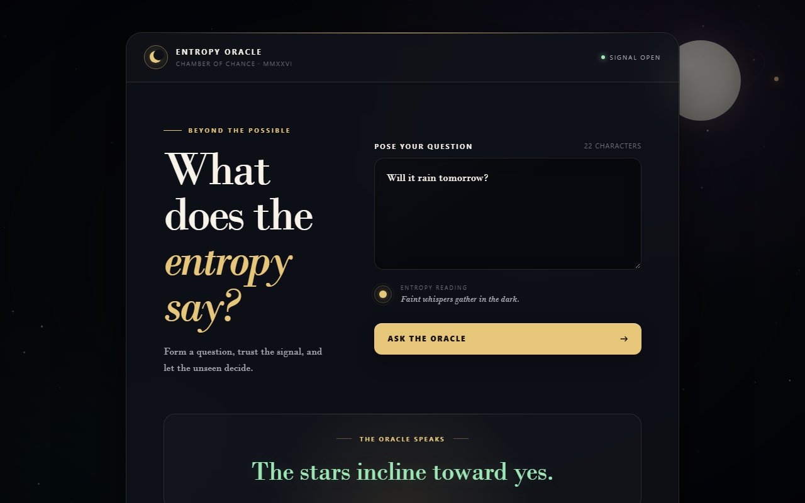

# Entropy Oracle

Ask a question, consult the oracle. A tiny Flask web app that reads the
Shannon entropy of your words and answers with a daily, question-anchored
fortune. The same endpoint also carries a hidden channel: a Python client
can smuggle a JSON document to the server inside a normal-looking oracle
request.

<p align="center">
  
</p>

## How it works

**Browser flow (regular use):**

1. Open the page, type a question. The page shows a live reading of the
   text's entropy (no numbers, just mood).
2. Click "Ask the oracle". The browser re-issues a GET with your text in the
   `X-Entropy-Input` header — never in URL query parameters.
3. The server normalizes your text into sorted unique words, combines that
   key with the current local day, and draws the same daily answer from its
   table (20 positive / 10 neutral / 10 negative).

**Payload flow (Python client):**

Identical HTTP round-trip, but the header text is a compressed + encoded
JSON document: `<6-char checksum> <base63 body>`. The server verifies the
checksum, decodes and decompresses the body, hands the JSON string to
`dummy()` in `server/handlers.py`, and answers exactly as in the browser
flow. Callers sending `Accept: application/json` get back
`{"answer": "..."}` instead of the HTML page.

One constraint worth knowing: everything rides in a single request header,
so payload size is capped by server and proxy header limits (often around
8 KB). The browser JS retries oversized requests as a form POST; the Python
client does not. Compressed JSON normally fits with room to spare, but keep
documents modest.

## Quickstart

Requires Python 3.10+ and [`uv`](https://docs.astral.sh/uv/).

```bash
uv sync
cp .env.example .env   # optional: defaults work out of the box
uv run python -m server.server
```

Then open `http://127.0.0.1:5000` in a browser, or send a JSON payload
from another terminal (server must be running):

```bash
uv run python client/example.py '{"hello": "world"}'
```

The demo defaults to a 2048-byte sample document and prints per-compressor
sizes, the shipped payload length, and the server's answer. With a secret
set, the compressed bytes are XOR-scrambled first (same length, opaque body):

```bash
PAYLOAD_SECRET=brass-gears-2026 uv run python client/example.py
```

From your own script:

```python
import client.client as client
answer = client.main('{"hello": "world"}')
```

## Container

Pushes to `master` and `v*` tags publish a multi-architecture image to
`ghcr.io/thywolf/exfoliator` through GitHub Actions. Manual runs from the
Actions tab publish too. The default deployment is defined in
`docker-compose.yaml`:

```bash
docker compose pull
docker compose up -d
```

Portainer can deploy the repository directly and use `docker-compose.yaml` as
the stack Compose path. Its stack environment variables can override every
default, including `IMAGE_TAG`, `HOST_PORT`, `PORT`, `ENTROPY_PATH`,
`PAYLOAD_SECRET`, `TZ`, and `GUNICORN_CMD_ARGS`. The first GHCR package is
private by default; make it public for anonymous pulls or configure registry
credentials in Portainer.

`HANDLERS_FILE` selects the host file mounted read-only at
`/app/server/handlers.py`. It defaults to the repository's
`server/handlers.py`, which works for local Compose and Portainer relative-path
volumes. With Portainer CE, set it to an absolute path on the Docker host for
a custom handler. Recreate the container after editing the file; it must be
readable by the container's non-root user.

## Security notes

The oracle answers anyone who can reach it, and the payload channel is no
exception. Worth knowing before you expose an instance:

- Payloads are unauthenticated, and `PAYLOAD_SECRET` does not gate them. The
  secret only obscures scrambled bodies; any visitor can hand `dummy()`
  arbitrary JSON either way.
- Replacing `dummy()` means writing code that untrusted internet input
  reaches. Validate before acting, and never pass payload content to `eval`,
  `exec`, or a shell.
- The scramble layer is obfuscation, not encryption. Treat anything a client
  sends as public.
- There is no rate limiting. Put a reverse proxy in front if the instance
  faces the internet.

## Configuration

| Var | Used by | Default | Meaning |
| --- | ------- | ------- | ------- |
| `ENTROPY_PATH` (`APP_PATH`/`BASE_PATH`/`ROUTE_PATH` aliases) | server | `/` | endpoint path |
| `HOST`, `PORT` | server | `127.0.0.1:5000` locally, `:5000` in the container | bind address |
| `SERVER_URL` | client | `http://127.0.0.1:5000` | server base URL |
| `PAYLOAD_SECRET` | both | unset (layer off) | secret word for the scramble layer; must match on both sides |
| `IMAGE_TAG` | Compose | `latest` | GHCR image tag |
| `HOST_PORT` | Compose | `5000` | published host port |
| `HANDLERS_FILE` | Compose | `./server/handlers.py` | host handler file mounted into the container |
| `GUNICORN_CMD_ARGS` | container | two workers, four threads | Gunicorn process and logging configuration |
| `TZ` | server | `Europe/Warsaw` in Compose | local calendar day used by the oracle |

## Custom logic

Decoded payloads land in `dummy()` in `server/handlers.py`. Edit that file
to implement your own handling — `server/server.py` needs no changes.
The call leaves no trace in the HTTP response. Read the security notes
before shipping a real handler.

## Wire format (frozen)

- Body alphabet (base63): `a-z A-Z 0-9` + space; big-int encoding, leading
  `0x00` bytes preserved as leading `a`s.
- Checksum: CRC32 of the base63 body, base62-encoded (`0-9 A-Z a-z`) to
  exactly 6 chars. Payload = `<checksum><space><body>`.
- Compressor trial order `zlib → bz2 → lzma → raw`; shortest body wins.
- Optional scramble: XOR with a SHA-256-CTR keystream, key = `sha256(secret)`.
  Obfuscation, not authenticated encryption.

## Layout

- `server/server.py` — Flask app, single endpoint, entropy + answer draw.
- `server/handlers.py` — user-editable `dummy()` payload hook.
- `client/client.py` — importable sender (`client.main(json_string, ...)`).
- `client/example.py` — runnable demo incl. the 2048-byte showcase.
- `Dockerfile` — minimal multi-stage production image.
- `docker-compose.yaml` — Portainer-ready stack using the published image.
- `.github/workflows/container.yml` — tests, multi-arch build, GHCR publish, attestation.
- `tests/` — pytest suite.
- `AGENTS.md` — conventions and hard rules for coding agents.

```bash
uv run pytest -q   # full suite, keep it green
```

## License

MIT — see [LICENSE](LICENSE).
